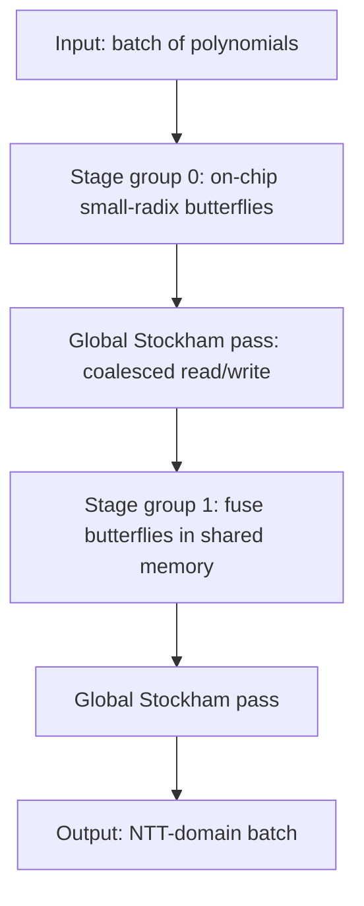

# Goldilocks Field (p = 2^64 − 2^32 + 1): Mathematical Structure and High-Performance GPU Realization

## Executive summary

The “Goldilocks” prime field uses the 64-bit prime  
\(p = 2^{64} - 2^{32} + 1 = \mathtt{0xffffffff00000001}\), selected explicitly for *hardware-level efficiency* of modular arithmetic and large power-of-two FFT/NTT subgroups. citeturn27view1turn14view0turn15view0

Its defining identity \(2^{64} \equiv 2^{32} - 1 \pmod p\) makes reduction of 128-bit intermediates unusually cheap: reduction can be expressed in terms of a handful of 32/64-bit shifts, adds, and subtracts, with only occasional conditional correction. citeturn27view1turn27view2turn15view0 This same structure is exploited in production code (e.g., Plonky2’s `reduce128`) by splitting high 64 bits into two 32-bit halves, thereby turning the “hard part” of modular reduction into operations on values that fit in 32 bits. citeturn15view0turn27view2

Algebraically, \(p-1 = 2^{32}(2^{32}-1)\), so the field has **2-adicity 32**, i.e., it contains a primitive \(2^{32}\)-th root of unity, enabling NTT sizes up to \(2^{32}\) (far beyond what any single machine will store, but extremely convenient for choosing transform sizes as powers of two). citeturn15view0turn14view0turn3search14 Moreover, several implementations choose a specific \(2^{32}\)-root of unity so that **8 is a 64th root of unity**, letting early-stage twiddles collapse to shifts (a key motif in “Goldilocks NTT trick” style optimizations). citeturn14view0turn18view0turn15view0

On GPUs, the practical win is that Goldilocks arithmetic can be implemented with **one 64×64→128 multiply** and a small fixed sequence of integer ops for reduction—using `mulhi` intrinsics (`__umul64hi` in CUDA, `__mul_hi`/equivalents in HIP). citeturn0search3turn0search14turn15view0 The design space then becomes: (1) how to map butterflies and twiddle access so that global memory is coalesced, (2) how to use shared memory without bank conflicts for 64-bit data, and (3) whether to store residues in canonical form or in a redundant/non-canonical range to reduce corrections (a classic NTT optimization). citeturn16search7turn17search1turn15view0turn3search17

Finally, security-wise, a 64-bit base field is **not** appropriate for discrete-log-based cryptography, but it *is* appropriate for FRI/STARK-style polynomial IOPs where security is statistical and depends on field size, extension degree, and query parameters. This is why Plonky2 encodes witnesses in Goldilocks for speed, but still uses an extension field in protocol parts that require higher soundness margins. citeturn27view0turn27view2turn6search1

## Algebraic structure and “amazing” field properties

Goldilocks’ specialness is not just “it fits in 64 bits.” It is *structurally aligned* with machine words and power-of-two transforms.

**Prime structure and representation.** Multiple implementations pin the modulus as  
\(\mathtt{0xffffffff00000001}\) and explicitly document the field as a prime field with efficient reduction. citeturn14view0turn15view0 The Plonky2 design document states the field was chosen “for speed of computation” because elements fit in a 64-bit word and the modulus structure yields an “efficient reduction method.” citeturn27view1turn27view2

**2-adicity and smooth subgroup.** From \(p-1 = 2^{64}-2^{32} = 2^{32}(2^{32}-1)\), the 2-adic valuation is exactly 32, so \(\mathbb{F}_p^\*\) contains a subgroup of size \(2^{32}\) and, equivalently, a primitive \(2^{32}\)-th root of unity. Implementations expose this as `TWO_ADICITY = 32`. citeturn15view0turn14view0 The odd factor \(2^{32}-1\) further factors into small Fermat-prime factors \(3\cdot 5\cdot 17\cdot 257\cdot 65537\), often highlighted in NTT-friendly prime discussions because it implies many other small smooth subgroups exist too. citeturn3search14

**Explicit generators and roots of unity.** Production code commonly hard-codes:
- a multiplicative generator for \(\mathbb{F}_p^\*\) (for example, Plonky2 uses a constant labeled as a multiplicative generator), and  
- a “power-of-two generator” / \(2^{32}\)-root of unity (e.g., `7277203076849721926`). citeturn15view0turn14view0

A notable “engineering” property is choosing the \(2^{32}\)-root of unity so that the induced generator for size 64 is **8**, because multiplication by 8 is a left shift by 3 (modulo adjustments aside). Winterfell documents this as: “8 is the 64th root of unity,” explicitly calling out optimized FFT potential. citeturn14view0

**Relation to cyclotomic / Solinas forms.** In base \(B=2^{32}\),  
\(p = B^2 - B + 1\), i.e., \(p = \Phi_6(B)\) (since \(\Phi_6(x)=x^2-x+1\)). This situates Goldilocks within the broader family of *Solinas / generalized Mersenne* primes used to avoid division in reduction. citeturn27view2turn30search2turn30search5

**Extension fields \(\mathbb{F}_{p^k}\) and Frobenius structure.** Goldilocks supports the usual extensions \(\mathbb{F}_{p^k} \cong \mathbb{F}_p[X]/(f)\) for irreducible \(f\) of degree \(k\). Two pragmatically important points from real implementations:

- Some systems use extensions primarily for *soundness / security margin*, not for arithmetic convenience. Plonky2 explicitly uses an extension field in protocol parts requiring “a larger field for soundness,” citing \(\mathbb{F}_p[X]/(X^2-7)\) as the specific quadratic extension. citeturn27view2  
- Other systems define extensions with polynomials chosen to make multiplication/squaring cheap. Winterfell defines (at least) a quadratic extension over an irreducible polynomial \(x^2-x+2\) and provides optimized formulas (Karatsuba-like) for extension multiplication and squaring, plus an explicit Frobenius map. citeturn14view0

The key “takeaway for GPUs” is that extension arithmetic typically multiplies the base-field cost by a small constant (e.g., ~3 base multiplies for quadratic) and is still highly parallelizable, but increases register pressure and memory bandwidth proportionally.

## Concrete arithmetic algorithms for Goldilocks

This section centers on the “pseudo-Mersenne” / Solinas-style reduction that makes Goldilocks fast in practice, and how different libraries structure representation choices.

### Addition and subtraction

A unifying trick is to leverage the fact that  
\(p = 2^{64} - \varepsilon\) where \(\varepsilon = 2^{32}-1\). Plonky2’s field implementation exposes \(\varepsilon\) as `EPSILON` and uses overflow/underflow flags to correct results via adding/subtracting \(\varepsilon\) instead of materializing \(p\) itself. citeturn15view0turn27view2

Conceptually, if you compute in 64-bit wraparound arithmetic:
- if \(a+b\) overflowed 64 bits, then \((a+b) \bmod p\) can be corrected by adding \(\varepsilon\) (since subtracting \(p\) equals adding \(2^{64}-p=\varepsilon\) in 64-bit wraparound). citeturn27view2turn15view0  
- similarly, if \(a-b\) underflowed, correct by subtracting \(\varepsilon\) (equivalently add \(p\)). citeturn15view0turn27view2

This algebra-to-instruction mapping is explicitly discussed in the Plonky2 paper: many architectures can set a register to either 0 or \(2^{32}-1\) based on carry/borrow flags, which can reduce register pressure because the modulus need not be loaded as a constant. citeturn27view2

### Fast reduction of 128-bit products

The defining identity is:
\[
2^{64} = p + (2^{32}-1)\quad\Rightarrow\quad 2^{64}\equiv 2^{32}-1=\varepsilon \pmod p.
\] citeturn27view1turn27view2

Plonky2’s field-selection section shows a particularly useful refinement:
\[
2^{96} \equiv -1 \pmod p,
\]
which supports rewriting a 128-bit integer \(n\) as  
\(n = n_0 + 2^{64}n_1 + 2^{96}n_2\) with \(n_0\) 64-bit and \(n_1,n_2\) 32-bit, yielding
\[
n \equiv n_0 + (2^{32}-1)n_1 - n_2 \pmod p,
\]
where \((2^{32}-1)n_1\) is just a shift and subtract. citeturn27view1turn27view2

Plonky2 code implements this as `reduce128`, explicitly splitting the high 64 bits into high/high and high/low 32-bit halves, then applying a rare-branch correction on borrow. citeturn15view0

Winterfell uses a different—but related—engineering choice: it represents elements in **Montgomery form** and provides constant-time routines; it still leverages Goldilocks structure for fast operations (including fast multiplication by a small 32-bit factor). citeturn14view0

### Canonical vs non-canonical (redundant) representations

A major practical optimization in NTT-heavy workloads is to allow intermediate residues to live in a *redundant range* (e.g., \([0,2^{64})\) rather than \([0,p)\)) and only canonicalize when needed. This is exactly how many “fast NTT” implementations reduce the number of conditional corrections. citeturn17search1turn15view0turn3search17

Two concrete examples:

- Plonky2 explicitly supports operations on “non-canonical” u64 values and only applies a final conditional subtraction for canonicalization. citeturn15view0turn27view2  
- Miden’s `Felt` documentation notes that *any* `u64` is accepted and “no reduction is performed since Goldilocks uses a non-canonical internal representation.” citeturn3search17

For GPU kernels, redundant ranges are often a *win* because they remove branches (or make them rarer), improving warp-level convergence.

### GPU-ready reduction path: what you actually need from hardware

At minimum, you need:
- low 64 bits of a 64×64 product, and
- high 64 bits of that product.

CUDA exposes this directly via `__umul64hi` for the high half of the 128-bit product. citeturn0search3turn0search21 HIP exposes the analogous functionality (`__mul_hi` / `__umul64hi`-style primitives) for AMD GPUs. citeturn0search14

With `{lo, hi}`, Goldilocks reduction can follow the same decomposition as `reduce128` (split `hi` into 32-bit halves, then do fixed arithmetic with \(\varepsilon\))—with no integer division and no 128-bit integer type required.

The following mermaid sketch captures the dataflow in a GPU-friendly `mul_mod_p`:

```mermaid
flowchart TD
  A[a: u64] --> M[64x64 multiply]
  B[b: u64] --> M
  M --> LO[lo = mul_lo_u64(a,b)]
  M --> HI[hi = mul_hi_u64(a,b)]
  HI --> HILO[hi_lo = hi & 0xffffffff]
  HI --> HIHI[hi_hi = hi >> 32]
  LO --> T0[t0 = lo - hi_hi (with rare borrow fix)]
  HILO --> T1[t1 = hi_lo * (2^32-1)]
  T0 --> ADD[t2 = t0 + t1 (with carry->epsilon fix)]
  T1 --> ADD
  ADD --> OUT[non-canonical u64 residue]
```

This matches the reduction approach described in the Plonky2 paper and implemented in Plonky2/Winterfell-style code. citeturn27view2turn15view0turn14view0

## NTT/FFT design exploiting 2^32 roots of unity

Goldilocks is “NTT-native” primarily because of its 2-adicity and the fact that implementers can choose roots that make small stages unusually cheap.

### Transform sizes and twiddle structure

With 2-adicity 32, Goldilocks supports power-of-two NTT lengths up to \(2^{32}\). citeturn15view0turn14view0 In ZK proving workloads, the actual sizes are almost always far smaller (memory dominates), but having a comfortably large 2-power subgroup matters because it avoids “performance cliffs” when circuit sizes grow and you need to move to the next power-of-two domain.

A practical trick is selecting a \(2^{32}\)-root of unity whose derived roots for small domains become simple powers of two (e.g., making 8 a 64th root). Winterfell calls this out explicitly as enabling shift-based replacements for multiplications in optimized FFTs/NTTs. citeturn14view0turn18view0

### Algorithmic variants that matter on GPUs

Most NTTs in provers use Cooley–Tukey butterflies; the GPU question is *memory traffic pattern*, not just arithmetic.

- **Iterative in-place DIT/DIF** often produces strided loads/stores in later stages, hurting global memory coalescing.  
- **Stockham autosort** variants trade extra passes (and often out-of-place buffering) for consistently coalesced access patterns and elimination of explicit bit-reversal. This is a common choice in high-performance GPU FFT/NTT designs. citeturn1search14turn16search7

A widely used optimization in word-sized NTT arithmetic is redundant representation / “lazy reduction,” minimizing modular corrections inside butterflies. David entity["people","David Harvey","mathematician, ntt"] highlights this theme: much of the speedup can come from reducing the number of modular reductions/corrections rather than speeding up a single reduction. citeturn17search1turn17search8

### Twiddle multiplication optimizations

Even when base-field multiplication is cheap, twiddle multiplication dominates large transforms. Two important families of techniques:

- **Precompute twiddles per stage** (or per block) and use fast modular multiply; this is the baseline for GPU implementations because it avoids per-thread exponentiation. citeturn1search14turn1search13  
- **Shoup-style constant multiplication** (store an approximate reciprocal / high-word helper) reduces the cost of multiplying by a fixed constant modulo a word-sized prime, and underpins many fast NTT implementations in lattice crypto and exact convolution. citeturn17search1turn17search18

Goldilocks adds a third knob: if early-stage twiddles are powers of two (or close), you can replace multiply-by-twiddle with shifts and a small correction path—exactly the sort of micro-optimization emphasized in “Goldilocks NTT trick” discussions. citeturn14view0turn18view0

## GPU implementation strategies and kernel patterns

This section focuses on mapping Goldilocks arithmetic and NTTs to GPU execution models (SIMT), with an emphasis on portability across CUDA and ROCm/HIP.

### SIMT execution model realities

GPU behavior is architecture-specific, but two stable planning constraints are:

- **Thread grouping.** NVIDIA executes in warps (commonly 32 threads). AMD wavefront size varies; RDNA defaults to 32-wide “warp” behavior but can also run in wave64 mode for compatibility. citeturn16search21  
- **Shared memory bank conflicts.** Shared memory is banked, and conflicts serialize accesses when a warp’s threads contend for the same bank. This is a standard performance pitfall; it appears directly in NVIDIA best-practice discussions and many bank-conflict demonstrations. citeturn16search7turn16search11turn16search22

For 64-bit field elements, bank conflicts are a practical hazard because many GPUs have 32-bit bank granularity; a naive `u64 shared[ ]` layout can cause systematic 2-way conflicts unless you pad or split into two `u32` arrays. citeturn16search11turn16search22

### Two viable data representations on GPUs

**Native u64 residues.**  
Pros: simplest; matches CPU implementations; directly uses `mulhi` intrinsics. citeturn0search3turn0search14turn15view0  
Cons: u64 integer throughput varies across GPU generations; you must be careful with shared-memory banking and register pressure. Empirically, many practitioners note that 64-bit integer operations can be notably slower than 32-bit on some architectures (and the ratio can change across GPU lines). citeturn16search0turn16search5

**Split-limb (2×u32) residues (base 2^32).**  
Pros: often better throughput on hardware optimized for 32-bit integer ALUs; easier to arrange conflict-free shared memory; can exploit that \(\varepsilon = 2^{32}-1\) is “all ones,” which simplifies some corrections. citeturn15view0turn27view2  
Cons: more instructions; more complex reduction/carry logic; need careful validation.

Both approaches can be correct and fast; the right choice depends on whether your target GPU family has “good” u64 integer throughput and on how shared memory is used in your NTT kernels.

### Arithmetic kernel pseudocode patterns

Below are GPU-oriented pseudocode sketches (C-like). They match the Plonky2-style reduction strategy and require only `mul_hi_u64` and normal 64-bit ops.

**Goldilocks multiply modulo p (non-canonical output):**

```c
// Constants
const uint64 EPS = 0xffffffffULL;             // 2^32 - 1
// p = 2^64 - EPS

uint64 mul_mod_p(uint64 a, uint64 b) {
    uint64 lo = a * b;
    uint64 hi = mul_hi_u64(a, b);             // e.g. __umul64hi in CUDA
    uint64 hi_hi = hi >> 32;
    uint64 hi_lo = hi & EPS;

    // t0 = lo - hi_hi ; if borrow, subtract EPS (rare)
    uint64 t0 = lo - hi_hi;
    if (lo < hi_hi) t0 -= EPS;

    uint64 t1 = hi_lo * EPS;                  // 32x32 -> 64 safe
    // t2 = t0 + t1 ; if carry, add EPS
    uint64 t2 = t0 + t1;
    if (t2 < t0) t2 += EPS;

    return t2;                                // in [0, 2^64)
}
```

This mirrors the decomposition in Plonky2’s `reduce128` and paper discussion. citeturn15view0turn27view2turn0search3

**Butterfly (DIT) with lazy reduction:**

```c
// Computes (a + w*b, a - w*b), inputs in non-canonical range.
// Optional: delay canonicalization to end of stage or end of transform.
void butterfly(uint64* a, uint64* b, uint64 w) {
    uint64 wb = mul_mod_p(w, *b);   // non-canonical
    uint64 x  = add_mod_p_lazy(*a, wb);
    uint64 y  = sub_mod_p_lazy(*a, wb);
    *a = x;
    *b = y;
}
```

Here `add_mod_p_lazy` and `sub_mod_p_lazy` should be written branch-minimizing (e.g., using carry/borrow-based epsilon corrections) in the Plonky2 style. citeturn15view0turn27view2

### NTT kernel structuring on GPUs

A commonly effective plan (also reflected in GPU-NTT literature) is:

- Do **small NTTs in shared memory** within blocks (e.g., 1k–8k points depending on shared memory budget), fusing multiple stages while data stays on-chip. citeturn1search14turn16search7  
- Use a **Stockham-style global pass** for large sizes to keep global accesses coalesced (read contiguous, write contiguous each pass), at the cost of ping-pong buffers. citeturn1search14turn16search7  
- Batch across many polynomials (or many independent transforms) to saturate the GPU; ZK provers naturally offer this batching opportunity in commitment opening, FRI layer transforms, or trace polynomial processing. citeturn1search13turn6search1

A high-level flow for a batched Stockham NTT looks like:



### CUDA/HIP-specific guidance (portable principles)

- Use `mulhi` intrinsics for 64×64→128 products (CUDA `__umul64hi`, HIP equivalents). citeturn0search3turn0search14  
- Make global reads/writes coalesced: consecutive threads should access consecutive 64-bit elements whenever possible (Stockham helps). citeturn16search7turn1search14  
- Avoid shared-memory bank conflicts by layout choices: (a) pad `u64` arrays, or (b) store low/high 32-bit halves in separate shared arrays, or (c) rely on warp shuffles for within-warp exchanges. citeturn16search7turn16search11turn16search22  
- On AMD, tune for wave32 vs wave64 behavior: divergence cost, shuffle intrinsics, and shared-memory access patterns depend on wave size. citeturn16search21

## Extension fields, multi-precision, and batching on GPUs

### Quadratic/cubic Goldilocks extensions

Goldilocks-based provers often require an extension field for soundness (FRI-style sampling, DEEP composition, etc.). Plonky2 explicitly uses a quadratic extension \(\mathbb{F}_p[X]/(X^2-7)\) in protocol components that need a “larger field … for soundness.” citeturn27view2turn27view0

Winterfell illustrates another engineering approach: pick irreducible polynomials that admit *very low-multiplication-count* formulas. Its quadratic extension uses a 3-multiplication formula and provides optimized squaring and Frobenius. citeturn14view0

On GPUs:

- Prefer **structure-of-arrays (SoA)** for extension coefficients: store all “a” coefficients contiguous and all “b” coefficients contiguous. This improves coalescing and cache behavior compared to array-of-structs.  
- Fuse operations when possible: extension multiplication is multiple base multiplies plus adds; if you inline base multiply+reduce, you can reduce temporary spills.

### Multi-precision fields (BN254, BLS12-381, Pasta) and GPU suitability

Compared to Goldilocks, prime fields used in pairing-based SNARKs and curve cycles are multi-limb (typically 255–381 bits), so each field multiply requires multiple 32/64-bit multiplies, carry propagation, and a full modular reduction (often Montgomery). This increases instruction count, register pressure, and memory footprint, making NTTs and MSMs heavier per operation.

Despite that, practical GPU acceleration exists: the gnark library from entity["company","ConsenSys","ethereum software company"] notes experimental GPU acceleration through ICICLE for Groth16 on BN254, BLS12-377, BLS12-381, and BW6-761. citeturn36search8turn36search0 This ecosystem context matters for comparisons: Goldilocks aims to *avoid* those heavy multi-precision costs in FRI-based proving systems by moving witness arithmetic into a small word field. citeturn27view0turn36search25

## Security implications and ecosystem comparisons

### Security of 64-bit fields in ZK protocols

A 64-bit prime field is far too small for discrete-log-based cryptographic assumptions (generic attacks scale like \(\sqrt p \approx 2^{32}\)). This is why Goldilocks is not used as an ECC base field for standard cryptographic groups.

However, FRI/STARK-style arguments are *information-theoretic / statistical* in soundness: many errors are bounded as a function of parameters and \(|\mathbb{F}|\). Plonky2’s design explicitly leans on this: because FRI “does not require a large-characteristic field,” it encodes the witness in a 64-bit field for performance. citeturn27view0turn27view1 When additional soundness margin is needed, it uses an extension field. citeturn27view2

Winterfell’s security estimation code similarly treats “field security” as roughly proportional to `(base_field_bits * extension_degree)` (then combined with other protocol parameters). citeturn6search1 This makes the engineering tradeoff explicit: **small base field + modest extension (degree 2 or 3)** can reach ~100+ bit targets while retaining fast base arithmetic.

### Constant-time and side-channel considerations

Even in proof systems, constant-time behavior can matter:
- When provers handle secret witnesses, secret-dependent memory access patterns and branches can leak information through timing/microarchitectural channels.
- NTT implementations in cryptography have a long history of requiring constant-time behavior; many works emphasize replacing `%` division paths and table-lookup hazards with constant-time Montgomery/Shoup-style arithmetic. citeturn17search19turn17search3

Goldilocks helps here by eliminating division from reduction and enabling branch-minimized arithmetic; Winterfell explicitly documents constant-time intent for its Goldilocks-field implementation. citeturn14view0

### Benchmarks and practical performance signals

The Plonky2 paper reports that on a commodity laptop it takes “about 300 milliseconds to generate a recursive proof,” and ties this performance to encoding witness data in a 64-bit field. citeturn27view0turn27view1 Polygon’s deep-dive blog claims that simply using Goldilocks instead of a 256-bit field improved proving speed by ~40× in a field-operations performance measure. citeturn36search25

On the GPU side, public reports exist but vary widely by workload composition (NTT vs hashing vs MSM vs witness generation). For example, an Orbiter Finance write-up describes a GPU speedup for a batched secp256k1 signature verification circuit in Plonky2 (reported 59.23% speedup in that case). citeturn36search2 These numbers should be treated as workload- and engineering-dependent, not as intrinsic constants of the field.

### Comparison table: Goldilocks vs common ZK fields

The table below compares important *implementation-facing* attributes. Values for 2-adicity are taken from field/library documentation where available; “GPU suitability” is qualitative and assumes no specific GPU model.

| Field / ecosystem use | Prime size & typical word layout | Reduction style (typical) | Max power-of-two subgroup (2-adicity) | FFT/NTT friendliness | Typical ZK use-cases | GPU suitability (qualitative) |
|---|---:|---|---:|---|---|---|
| Goldilocks \(2^{64}-2^{32}+1\) | 64-bit (\(u64\)) | pseudo-Mersenne/Solinas-style fold; often lazy non-canonical | 32 citeturn15view0turn14view0 | Excellent; can pick roots so small stages use shifts (e.g., 8 as 64th root) citeturn14view0turn18view0 | FRI/STARK and Plonky2-style PLONK+FRI recursion citeturn27view0turn27view1 | High: single-limb arithmetic, no division; careful shared-mem layout needed |
| BN254 scalar-field family (common in on-chain pairing precompiles) | ~254-bit (multi-limb) | Montgomery | 28 (documented for BN254 scalar field) citeturn33search9 | Good but smaller 2-power than 32-adic fields | KZG/Groth16/PLONK systems targeting Ethereum precompiles | Medium: multi-limb cost high; still accelerated in practice via specialized libraries citeturn36search8turn36search0 |
| BLS12-381 scalar field | ~255-bit scalar field (multi-limb) | Montgomery | \(2^{32}\mid (r-1)\) (≥32) citeturn35view0turn32search22 | Very good; large 2-power subgroup noted in curve design literature | KZG commitments and modern proof systems; broader ecosystem adoption | Medium: heavier arithmetic than Goldilocks; GPUs used for MSM/FFT in accelerators citeturn36search8 |
| Pasta fields (Pallas/Vesta) used in Halo2 | ~255-bit (multi-limb) | Montgomery / optimized prime-field arithmetic | 32 (Halo2 design: S=32 for both) citeturn32search0turn32search9 | Very good; tuned for PLONK-ish FFT needs | Halo2-style recursive proof composition (curve cycle) | Medium: still multi-limb; good 2-adicity helps FFT sizes |
| Mersenne \(2^{61}-1\) (example) | 61-bit (fits in u64) | Mersenne reduction | 1 in base field (but extensions can have large 2-adicity) | Poor in base field for radix-2; extensions can fix | Sometimes proposed for STARK variants / alternative designs | High for base-field ops; NTT benefits depend on extension strategy citeturn8search0 |

### When Goldilocks is the “right” choice

Goldilocks tends to dominate when:
- the protocol supports small characteristic / small bit-width fields (FRI/STARK-friendly), citeturn27view0turn27view1  
- the bottleneck is polynomial arithmetic (NTTs, low-degree testing, trace LDEs), and  
- you can recover security via extension degree and protocol parameters rather than relying on ECC hardness. citeturn27view2turn6search1

When you must verify succinctly on-chain in an ecosystem with pairing precompiles (e.g., BN254), or you use KZG commitments, you typically accept the multi-precision field cost and then push acceleration to GPUs/FPGAs via specialized arithmetic kernels. citeturn36search8turn33search9